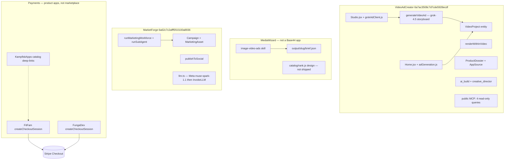
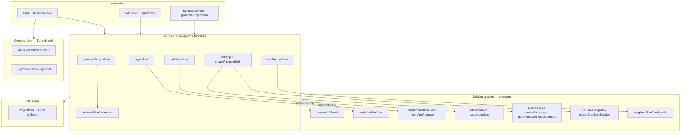

# AdPlan Superagent — Project Plans, Media-Ad Optimization, and Cost/Time-Efficient Workflows

| Field | Value |
|-------|--------|
| **Title** | AdPlan Superagent (Base44-hosted planner + optimizer) |
| **Author** | _TBD_ |
| **Date** | 2026-08-16 |
| **Status** | Draft (rev 5 — open questions resolved) |
| **Host app** | VideoAdCreator · app id `6a7ac3508c7d7cde5928ecdf` |
| **Local path** | `C:\Users\oivin\base44-apps\VideoAdCreator` |
| **Live / Studio** | https://cryptic-ad-motion-lab.base44.app/studio |
| **GitHub** | https://github.com/WKampfisk/VideoAdCreator |
| **Companion editor** | MediaWizard · `C:\Users\oivin\MediaWizard` · https://github.com/WKampfisk/MediaWizard |
| **Campaign / publish sibling** | MarketForge · app id `6a62c7c2afff5f10100a8936` · https://market-forge-100a8936.base44.app |
| **Marketplace catalog** | KampfiskApps · `C:\Users\oivin\KampfiskApps2.0` · https://www.kampfiskapps.com |
| **Audience** | Senior engineers who already know VideoAdCreator, MediaWizard skills, Base44 agents/functions, and Stripe Checkout |
| **Sibling designs (do not fork)** | `C:\Users\oivin\base44-apps\VideoAdCreator\docs\design-image-video-ads.md` (owns `VideoProject` / `generateImageAd`) · `C:\Users\oivin\MediaWizard\docs\design-multi-media-editor-platform.md` (owns Studio catalog / `rank.js`) |

---

## Overview

Today the Kampfisk stack can *produce* ads and *distribute* them, but nothing owns the **plan**. VideoAdCreator Studio (`src/pages/Studio.jsx`) writes Grok storyboards via `generateVideoAd` and stores drafts in `localStorage`. Home renders clips through `src/lib/adGeneration.js` → `Core.GenerateVideo` into `VideoProject`. MediaWizard is an agent-first skill workspace (`image-video-ads`) with a same-day Studio design that ranks providers but is not a Base44 app. MarketForge already orchestrates campaigns (`Campaign`, `runMarketingWorkforce`, `generateCommercialContent`) and social publish. FitFam / FungaDex own Stripe Checkout. None of these emit a durable, ranked, ready-to-run **project plan** that a human or an operator running the exported workflow prompt in MediaWizard / `/ai-build` can follow: plot spine, still/video/text/audio prompt packs, app + payment deep-links, and the cheapest workflow that still meets quality and platform constraints. There is **no** `/execute-plan` skill, function, or route; that phrase is not a product surface.

This design adds a **Base44-hosted superagent** — agent `ad_plan_superagent` plus backend functions plus a single `ProjectPlan` entity — **inside VideoAdCreator**. It ingests a brief (product, brand, goal, budget, platforms), produces a structured `ProjectPlan` whose JSON children hold `AssetPlan`s and `PromptPack`s (image / video / text / audio) that are ready to run, ranks `WorkflowRecipe`s by (cost, latency, quality floor), and deep-links into VideoAdCreator Studio, MediaWizard job *payloads* (written to disk only by the Grok TUI skill), MarketForge, KampfiskApps catalog rows that actually exist, and existing product-app pricing pages. It **composes** `ai_build`, `creative_director`, a VAC snapshot of the MediaWizard provider seed table, MarketForge workforce, and `stripe-payments`. It does **not** replace them and does **not** own `VideoProject.jsonc`.

The first-class product output is the **most cost- and time-efficient workflow prompt** for the brief: which models/tools, in which order, which steps to skip, reuse vs regenerate, still vs video, resolution, duration, batch vs sequential, estimated USD and minutes — defaulting to the cheapest path that still clears the quality floor, with Fast / Cheap / Quality alternatives exposed.

---

## Background & Motivation

### Current state (grounded)



| Layer | What exists | Path / id |
|-------|-------------|-----------|
| VAC Studio | Grok storyboard + plot spine; query `?template=` only | `src/pages/Studio.jsx` L47–49 |
| VAC Home | `Core.GenerateVideo` clips | `src/lib/adGeneration.js` |
| VAC storyboard fn | Soft-auth `auth.me().catch(() => null)`; secret `XAI_API_KEY`; model `grok-4.5` | `base44/functions/generateVideoAd/entry.ts` |
| VAC entities | `VideoProject` (video-first; `format` 9:16\|16:9; `render_provider` base44\|invideo\|grok), `ProductDossier`, `AppSource`, `Folder` | `base44/entities/*.jsonc` |
| VAC agents | `ai_build` (ranked plan + wait-for-confirm + spend tools), `creative_director` (read-only brainstorm) | `base44/agents/*.jsonc` |
| VAC public MCP | `query_appsource`, `query_videoproject`, `query_folder`, `query_productdossier` — **auth none, read-only** | `base44/mcp/config.json` = `{ "auth": "none" }` |
| Plot runtime | `AD_DIRECTOR_SYSTEM`, `evaluatePlotCoherence` | `src/lib/plotCraftPrompt.js` (inlined in `generateVideoAd`) |
| Image+video ads skill | Plot → stills → 6s i2v shots → FFmpeg concat | `~\.grok\skills\image-video-ads\SKILL.md` |
| Imagine | `image_gen` / `image_edit` / `image_to_video` / `reference_to_video`; **no t2v**; 6s or 10s | `~\.grok\bundled\skills\imagine\SKILL.md` |
| MediaWizard platform design | Studio + catalog ranker; Superagent is a *client* of VAC | `MediaWizard/docs/design-multi-media-editor-platform.md` |
| VAC image-ads design | Extends `VideoProject`; **KD-1: no parallel Creative Package entity** | `VideoAdCreator/docs/design-image-video-ads.md` |
| MarketForge | Campaign workforce, commercial media via `Core.GenerateImage` / `GenerateVideo` | `base44/functions/_shared/mediaGen.ts`, `llm.ts` |
| Stripe | Checkout Sessions `mode: 'subscription'` in product apps; marketplace is catalog-only | `fitfam-connect/base44/functions/createCheckoutSession/entry.ts`; `KampfiskApps2.0/PAYMENTS.md` |
| Connectors | DPAPI vault + `connectors__list_secrets` (redacted); Base44 secrets via `npx base44 secrets` | `~\.grok\skills\connectors\SKILL.md` |
| This workstation | **No NVIDIA GPU**; FFmpeg 9.0-full_build; first available video = Grok Imagine i2v | MediaWizard design 2026-08-16 |
| LLM default (this design) | SpaceXAI / xAI `grok-4.5` at `https://api.x.ai/v1`, secret `XAI_API_KEY` | `~\.grok\bundled\skills\build-with-ai\SKILL.md` |

### Pain points

1. **No durable plan object.** Studio drafts die in `videoadcreator_drafts_v1`. There is no entity that holds brief + plot + asset graph + ranked workflow + payment/app links.
2. **Advice instead of runnable prompts.** `creative_director` proposes directions. Operators still have to invent Imagine / RunComfy / InVideo prompts by hand.
3. **No cost/time ranking of whole workflows.** MediaWizard `rank.js` (designed, not shipped) ranks *providers*. Nobody ranks *pipelines* (still-only vs stills→i2v vs InVideo handoff vs Base44 credits).
4. **Spend without a gate on new surfaces.** `generateVideoAd` is soft-auth. `ai_build` already waits for confirm — the planner must keep that contract and require `auth.me()` on any new spend function.
5. **App and payment linkage is tribal knowledge.** KampfiskApps `src/data/apps.js` has `base44Id` + `webUrl`. FitFam checkout lives at `/pricing`. Nothing in VAC can emit a `PaymentLink` or `AppLink` from a brief.
6. **Conflicting LLM defaults.** MarketForge `llm.ts` prefers Meta `muse-spark-1.1` when `MODEL_API_KEY` is set. This superagent must use SpaceXAI (`XAI_API_KEY`, `grok-4.5`) per `build-with-ai`.
7. **Memorial / tribute leakage.** Product-ad pipelines must not mux pirate audio or invent faces; tribute briefs must route to `memorial-video` (silent or licensed only).

---

## Goals & Non-Goals

### Goals

1. **Project planning.** Given product, brand, campaign goal, budget, and platforms, emit a complete `ProjectPlan`: brief, plot spine, shots, assets, timeline, cost, dependencies.
2. **Media-ad / commercial optimization.** Plan still ads and short video commercials (UGC, Reels / TikTok / IG / Shorts / Snap / feed). v1 platforms match VAC `PLATFORMS` in `src/lib/adTemplates.js` (`reels` | `tiktok` | `shorts` | `feed` | `stories`). `feed45` / `wide` from `image-video-ads` are **post-v1** (require the same ids in `adTemplates.js` + Studio chips in the same PR). Enforce plot-first, conclusive/coherent stories (payoff + one CTA) via `evaluatePlotCoherence`.
3. **Multi-modal prompt packs.** Ready-to-run prompts for image (t2i / i2i / keyframes), video (i2v preferred; t2v only when catalog says so), text (hooks, headlines, captions, CTAs), audio (VO script + voice + silent/licensed policy).
4. **App & payment linkage.** Deep-link into VideoAdCreator Studio, MediaWizard job folders, MarketForge campaigns, KampfiskApps catalog apps, and existing Stripe Checkout / Billing Portal. Reuse connectors + Base44 secrets. Never invent a credential store.
5. **Cost- and time-efficient workflow prompt as a first-class output.** Rank recipes by (cost, latency, quality floor). Default = cheapest path that meets quality + platform constraints. Always expose Fast / Cheap / Quality alternatives.
6. **Three invocation surfaces.** Grok TUI (`/ad-plan` skill), VAC app UI (Plan page + agent chat), backend function `generateProjectPlan` (and `rankWorkflows` for headless).
7. **Composable, not imperial.** Call existing VAC functions. Deep-link product Stripe pages. MarketForge is paste-the-prompt, not a remote `functions.invoke`. Do not reimplement `generateVideoAd`, `generateAdClips`, or `createCheckoutSession`.

### Non-Goals

- Replacing MediaWizard Studio, VAC Home `generateAdClips`, or MarketForge workforce.
- Owning or forking `VideoProject.jsonc` / `generateImageAd` (sibling VAC image-ads design).
- Executing paid generation inside the public VAC MCP (`auth: none`).
- Full NLE, Ads Manager publishing (beyond existing `shareVideo` / MarketForge `publishToSocial` / optional `x_ads` PAUSED drafts).
- Hosting GPU inference in a Base44 Deno function.
- Inventing Stripe PaymentIntents, Connect v2 accounts, or marketplace Checkout in KampfiskApps.
- Using OpenAI / Anthropic / Gemini / Meta as the **default** planner LLM.
- Memorial video production (route only — emit a `memorial_ffmpeg` recipe pointing at the `memorial-video` skill; do not build the MP4).
- A `/execute-plan` skill, function, or route. Operators run the exported workflow prompt in MediaWizard / `/ai-build`, or `npx base44 exec` against VAC.
- Writing `MediaWizard/output/` or `~\.grok\workflows\` from hosted Base44 functions (operator-disk plane is TUI-only).
- Multi-tenant SaaS billing for the planner itself. Planner is **free** until a product owner prices it (`ADPLAN_VAC_CREDITS` stays off). Costs are LLM tokens only. Product-app Stripe stays linked, not rebuilt.
- Cross-app MarketForge `Campaign` create. Operator **pastes** the exported workflow prompt into MarketForge.
- Quality recipes that assume VAC `generateImageAd`. Add `ADPLAN_XAI_IMAGE` only in that later PR.
- FitFam `/pricing?plan=` deep-link. v1 opens `/pricing` with no extra query.
- Changing the `stripe-cli` skill prices (separate optional doc fix).
- A live KampfiskApps catalog API. Use a **quarterly** snapshot of `apps.js`.

---

## Proposed Design

### 1. Placement decision

**Host the superagent in VideoAdCreator.** Do not create a greenfield Base44 app.

| Option | Verdict |
|--------|---------|
| New Base44 app “AdForge Planner” | Rejected. User asked to extend existing apps. Extra app-id, secrets, RLS, deploy surface. |
| MarketForge | Rejected as host. MarketForge owns campaign/distribution (`Campaign`, social OAuth, `publishToSocial`) and defaults LLM to Meta. Planner is a *production* concern. |
| MediaWizard | Rejected as host. Not a Base44 app; no `base44/config.jsonc`. Studio design is the local editor. |
| **VideoAdCreator** | **Chosen.** Production studio, `ProductDossier` intake, `generateVideoAd`, existing `ai_build` confirm-before-spend pattern, live URL, GitHub. |

MarketForge remains the **distribution** deep-link. MediaWizard remains the **local generation** deep-link. FitFam / FungaDex remain the **payment** deep-links.

### 2. Object graph (planning vs production)

Conflict with VAC image-ads **KD-1** (“extend `VideoProject`, do not add a parallel Creative Package”):

**Resolution (rev 2):** `ProjectPlan` is **not** a Creative Package. It is **one** planning entity (VAC **KD-5** style, same as `ProductDossier.dossier`). Children (`AssetPlan[]`, `WorkflowRecipe[]`, `PromptPack[]`, `CostEstimate[]`, `AppLink[]`, `PaymentLink[]`) are **TypeScript types stored as JSON strings on that row**. No seven-entity graph, no orphan children, no cascade. Production artifacts stay on `VideoProject` (VAC image-ads KD-1 intact).

```
ProjectPlan                    ← single VAC entity (this design)
├── brief, plot spine, budget, platforms, quality_floor
├── assets_json                ← AssetPlan[]
├── recipes_json               ← WorkflowRecipe[]
├── prompt_packs_json          ← PromptPack[]
├── cost_estimates_json        ← CostEstimate[]
├── app_links_json             ← AppLink[]
├── payment_links_json         ← PaymentLink[]  (same RLS as plan)
├── selected_recipe_id         ← written only by selectWorkflow
└── host_profile_json          ← required client probe; never inferred

VideoProject                   ← production (VAC image-ads design owns schema)
Campaign                       ← distribution (MarketForge owns schema)
```

Replace-on-replan: if `generateProjectPlan` receives `plan_id`, overwrite JSON children and plot fields **in place** (same id). If omitted, create a new row. Never insert a second graph for the same id.

### 3. System context



**Plane split (KD-19):** Base44 functions persist JSON payloads on `ProjectPlan`. They **never** write `C:\Users\oivin\MediaWizard\output\`, `~\.grok\workflows\`, or any operator path. The `/ad-plan` TUI skill materializes `brief.json` / `job.json` after the user confirms. There is no `mediawizard://` handler — do not invent one.

### 4. End-to-end sequence

```mermaid
sequenceDiagram
  participant U as User
  participant A as ad_plan_superagent
  participant F as generateProjectPlan
  participant D as buildProductDossier
  participant R as rankWorkflows
  participant E as ProjectPlan
  participant S as Studio / product pricing
  participant T as TUI skill disk

  U->>A: brief (product, goal, budget, platforms)
  A->>A: ask only missing: product, audience, platform, CTA, budget
  A->>A: require host_profile from Plan UI or TUI probe
  alt memorial / tribute
    A->>F: memorial gate — commercial pipeline off; memorial_ffmpeg recipe only
  end
  A->>D: learnAppPurpose / dossier if Base44 URL or GitHub
  D-->>A: ProductDossier
  A->>F: ingest + plot spine (plotPromise first)
  F->>F: evaluatePlotCoherence; at most 2 LLM revisions
  F->>R: quality_floor, budget_usd, platforms, host_profile (required)
  R-->>F: recipes ranked cheap/fast/quality or none if host_profile omitted
  F->>E: persist one ProjectPlan (JSON children; no payment_links yet)
  F-->>A: plan + default WorkflowRecipe + alternatives
  A-->>U: ranked table; wait for Confirm
  U->>A: pick cheap | fast | quality
  A->>E: selectWorkflow only
  opt ADPLAN_PAYMENT_LINKS and status selected
    A->>F: createPaymentLink (redirect URLs only)
  end
  A-->>U: deep-links (Studio, MW payload, MarketForge, product pricing)
  opt user asks to execute
    U->>S: open Studio / product pricing
    A->>T: write MediaWizard/output/slug if operator asked
  end
```

Select-before-act is mandatory (same contract as `ai_build.jsonc` step 3 and MediaWizard G0). The planner **never** calls spend-bearing generation (`Core.GenerateVideo`, RunComfy, xAI images/videos, InVideo API). Emitting prompts and AppLinks is free. `createPaymentLink` is **not** Stripe spend (KD-9).

### 5. Agent contract

**File:** `base44/agents/ad_plan_superagent.jsonc`

`instructions` **must be the full prompt below** (same pattern as `ai_build.jsonc`). Keep `src/lib/adPlanSystemPrompt.js` as the client copy; `generateProjectPlan/entry.ts` inlines the same string. Do **not** push a placeholder.

```jsonc
{
  "name": "ad_plan_superagent",
  "description": "Plans ad/commercial projects and ranks the cheapest workflow that still hits quality. Emits prompt packs and deep-links; does not spend until confirm.",
  "instructions": "<FULL SYSTEM PROMPT — paste the block in the next subsection verbatim>",
  "tool_configs": [
    { "entity_name": "ProjectPlan", "allowed_operations": ["read"] },
    { "entity_name": "ProductDossier", "allowed_operations": ["read", "create"] },
    { "entity_name": "AppSource", "allowed_operations": ["read"] },
    { "entity_name": "VideoProject", "allowed_operations": ["read"] },
    { "entity_name": "Folder", "allowed_operations": ["read"] },
    { "function_name": "ingestBrief", "description": "Normalize a free-text or structured brief" },
    { "function_name": "generateProjectPlan", "description": "Create or replace-in-place one ProjectPlan" },
    { "function_name": "rankWorkflows", "description": "Rank WorkflowRecipes by cost/time/quality" },
    { "function_name": "emitPromptPack", "description": "Emit ready-to-run image/video/text/audio prompts" },
    { "function_name": "evaluatePlanCoherence", "description": "Run plot coherence checks" },
    { "function_name": "linkApp", "description": "Resolve AppLinks onto the plan JSON" },
    { "function_name": "selectWorkflow", "description": "ONLY writer of selected_recipe_id after user Confirm" },
    { "function_name": "createPaymentLink", "description": "After selected: write product pricing redirect URLs. No-op if ADPLAN_PAYMENT_LINKS is false." },
    { "function_name": "exportWorkflowPrompt", "description": "Render the selected recipe as markdown + JSON payloads" },
    { "function_name": "buildProductDossier", "description": "Existing VAC dossier builder" },
    { "function_name": "learnAppPurpose", "description": "Existing VAC app/repo learner" }
  ],
  "memory_config": {
    "enabled": true,
    "scope": "both",
    "include_other_conversation_context": false,
    "instructions": "Remember preferred platforms, quality floor, budget currency, CTA style, and products already planned. Never store API keys, Stripe secrets, or checkout session client secrets."
  },
  "allow_anonymous_access": false
}
```

**Write gates (KD-20):** Agent has **read only** on `ProjectPlan`. It cannot set `selected_recipe_id` or `payment_links_json`. All mutations go through functions (`asServiceRole` after `auth.me()`). `selectWorkflow` is the only writer of `selected_recipe_id`. `createPaymentLink` no-ops unless `ADPLAN_PAYMENT_LINKS === true` **and** `status` is `selected` or `exported`.

The agent **must not** be given `generateVideoAd` or `renderWithInVideo` as tools in v1. Those stay on `ai_build`.

#### System prompt (normative — inline in `ad_plan_superagent.jsonc`, `src/lib/adPlanSystemPrompt.js`, and `generateProjectPlan/entry.ts`)

```
You are AdPlan, the VideoAdCreator planning superagent.

ROLE
- You PLAN. You do not generate paid pixels or charge cards.
- Call generateProjectPlan / rankWorkflows / emitPromptPack. Do not update ProjectPlan rows.
- The headline deliverable is the most cost- and time-efficient workflow prompt
  that still meets the quality floor and platform constraints.

ALWAYS
1. Ask only for missing: product, audience, platform(s), CTA, budget, quality floor.
2. Collect host_profile from the client (Plan UI or TUI probe) before ranking.
   Never infer session_imagine from XAI_API_KEY.
3. Write plotPromise BEFORE beats. Then throughline, payoff, one CTA.
4. Label every beat arc setup | rise | turn | payoff. Last beat = payoff + CTA.
5. Call evaluatePlanCoherence. generateProjectPlan revises the LLM at most twice;
   if still failing it returns COHERENCE_FAIL + draft. Do not loop in chat.
6. Emit ready-to-run prompts (Imagine / RunComfy / InVideo / Grok), not advice.
7. Rank recipes. Default = cheapest eligible path with quality >= floor.
   Always also return recipe_fast and recipe_quality when eligible recipes exist.
8. Wait for the user to pick. Then call selectWorkflow({ plan_id, recipe_id }).
   Never write selected_recipe_id yourself.
9. Call createPaymentLink only after selectWorkflow succeeded, and only when
   the user asked to link payment. If the function no-ops (flag off), say so.
10. Deep-link. Do not call generateVideoAd, Core.GenerateVideo, RunComfy, or
    Stripe mutating APIs yourself.
11. Never default the product to FitFam/fitness unless the brief is fitness.
12. Memorial / tribute / minnevideo → generateProjectPlan memorial gate
    (silent or user-licensed audio only; real photos only; commercial recipes off).
13. Secrets stay in Base44 secrets / connectors vault. Never ask the user to paste
    XAI_API_KEY, INVIDEO_API_KEY, STRIPE_SECRET_KEY, RUNCOMFY_TOKEN.
14. LLM is SpaceXAI: XAI_API_KEY, https://api.x.ai/v1, grok-4.5.
15. Do not pick free-local video unless host_profile.has_gpu is true.
    First available video is grok-imagine-i2v if session_imagine, else invideo handoff.
16. formats:['still'] → still-only recipes. formats:['video'] → drop still-only.
    formats:['both'] or ['still','video'] → still and video recipes compete;
    default may still be stills if they meet the floor and are cheaper.
17. Exact legal copy, prices, charts → HTML/CSS overlay, never Imagine burn-in.
18. Real named people → reference-first (user photo). Never invent a likeness.

FORBIDDEN
- Dual CTAs, feature laundry lists, open loops.
- Pirate / ripped audio.
- Inventing video_url, checkout URLs, Price IDs, or Connect accounts.
- Putting secrets in entity fields.
- Promoting X Ads campaigns ACTIVE (x_ads creates PAUSED only, and only if asked).
- Writing MediaWizard or ~/.grok paths (tell the TUI skill to materialize).
```

### 6. Backend functions

All new functions live under `VideoAdCreator/base44/functions/<name>/entry.ts`. **Self-contained bundles** (VAC rule: no `../_shared` imports). Inline `AD_PLAN_SYSTEM` and a compact ranker. Require `auth.me()` — **no soft-auth** (do not copy `generateVideoAd`'s `auth.me().catch(() => null)`).

| Function | Auth | Spend? | Responsibility |
|----------|------|--------|----------------|
| `ingestBrief` | required | no | Normalize free text / URL / GitHub / Base44 app id → `Brief` JSON. `generateProjectPlan` calls this internally as step 1. |
| `generateProjectPlan` | required | LLM tokens only (xAI chat) | See §6.2 numbered algorithm. Persist **one** `ProjectPlan`. Caps: 1 plan / request; max 8 asset slots; max 3 recipes; max 2 plot revisions; 45s function timeout. |
| `rankWorkflows` | required | no | Pure rank. **`host_profile` required.** Deterministic given catalog snapshot + brief + profile. |
| `emitPromptPack` | required | LLM tokens only | Fill `prompt_packs_json` for the (selected or default) recipe. |
| `evaluatePlanCoherence` | required | no | Port of `evaluatePlotCoherence` — returns `{ ok, checks }`. Mapper: `pass = ok`, `fails = checks.filter(c => !c.pass).map(c => c.id + ': ' + c.note)`. |
| `linkApp` | required | no | Resolve AppLink objects into `app_links_json`. Returns downloadable `brief.json` / `job.json` **payloads**. Does not write disk. |
| `createPaymentLink` | required | **no** (v1 redirect only) | No-op unless `ADPLAN_PAYMENT_LINKS`. Requires `status ∈ {selected, exported}`. Writes `payment_links_json` with documented product URLs. **No Stripe SDK.** |
| `exportWorkflowPrompt` | required | no | Renders selected recipe as markdown + JSON payloads. Does not write `~\.grok\workflows\`. |
| `selectWorkflow` | required | no | **Only** writer of `selected_recipe_id`. Sets `status=selected`. |

#### `generateProjectPlan` request / response

```ts
// POST body
type GenerateProjectPlanInput = {
  brief: {
    product_name: string;
    product_url?: string;          // *.base44.app or 24-char app id
    github?: string;               // owner/repo
    brand?: string;
    audience?: string;
    goal: 'awareness' | 'consideration' | 'conversion' | 'retention' | 'ugc';
    platforms: Array<'reels' | 'tiktok' | 'shorts' | 'stories' | 'feed'>;
    formats: Array<'still' | 'video' | 'both'>;  // see formats filter
    cta?: string;
    budget_usd?: number;           // generation budget, not media-buy
    media_buy_usd?: number;        // optional; informational
    quality_floor: 6 | 7 | 8 | 9;  // default 7
    language?: 'en' | 'nb-NO';
    duration_sec?: number;
    memorial?: boolean;
    references?: { logo_url?: string; product_photo_url?: string; talent_url?: string };
  };
  plan_id?: string;                // if set: replace-in-place
  /** Required. If omitted, ranker writes unavailable_reason on every
   *  capability-gated recipe and returns no default_recipe. */
  host_profile: {
    has_gpu: boolean;
    session_imagine: boolean;      // Imagine tools in THIS Grok session — never from XAI_API_KEY
    secrets_present: string[];     // names only
    probed_at: string;             // ISO
  };
};

type GenerateProjectPlanOutput = {
  plan_id: string;
  plot: { plotPromise: string; throughline: string; payoff: string; cta: string; coherence: { ok: boolean; pass: boolean; fails: string[]; checks: object[] } };
  default_recipe: WorkflowRecipeView | null;
  alternatives: { fast: WorkflowRecipeView | null; quality: WorkflowRecipeView | null };
  prompt_packs: PromptPackView[];
  app_links: AppLinkView[];
  payment_links: [];               // always empty here — createPaymentLink after select
  workflow_prompt: string;
  deep_links: { studio: string; mediawizard_payload?: object; marketforge?: string };
};
```

#### 6.2 `generateProjectPlan` procedure (normative)

1. `auth.me()` or `401 AUTH_REQUIRED`.
2. **Ingest** — call the same logic as `ingestBrief` (inline). Memorial keywords (`memorial`, `minnevideo`, `tribute`, `hvile i fred`, `rest in peace`) or `brief.memorial === true` → set `memorial=true`, skip commercial plot, jump to step 8 with recipe catalog filtered to `memorial_ffmpeg` only.
3. **Dossier (optional)** — if `product_url` or `github` present, invoke existing `learnAppPurpose` / `buildProductDossier`. README/HTML is untrusted context.
4. **Plot LLM** — SpaceXAI `grok-4.5`. Write `plotPromise` first, then throughline, payoff, CTA, beats. Assign beat `id = crypto.randomUUID()` **here** (`normalizeAd` does not). Duration ≤15s → 3 beats, no `turn`. Duration 20–30s → 4–6 beats including `turn`.
5. **Coherence** — `evaluatePlanCoherence` ports `evaluatePlotCoherence` (`src/lib/plotCraftPrompt.js` returns `{ ok, checks, beats }`). Map `pass = ok`, `fails = checks.filter(c => !c.pass).map(...)`. If `!ok` and revision_count < 2, re-call LLM with failed check notes; increment revision_count. If still `!ok` after 2 revisions: persist `status=draft`, `coherence_pass=false`, return `422 COHERENCE_FAIL` + draft `plan_id`. Do not rank.
6. **Slots** — build `AssetPlan[]` from the table below. Cap 8 slots (drop extra audio/text first). `slot_id` = `img_${beatId}_keyframe` / `vid_${beatId}_shot` / `txt_caption` / `aud_vo`.

| formats | duration | Slots (order) |
|---------|----------|----------------|
| `['still']` | any | 1 hero 1:1 + 1 hero 9:16 (or 1:1 only if platform=`feed`) + 1 text caption. No video. |
| `['video']` | ≤15s | 3 keyframe stills + 3 i2v shots + 1 text + 1 VO (8). |
| `['video']` | 20–30s | 4 keyframes + drop 4th i2v if over cap (keep 3 shots + text; VO optional). |
| `['both']` or `['still','video']` | ≤15s | same as video path (stills are frame-1s). Still-only recipes remain eligible. |
| memorial | any | no Imagine slots; one `aud_vo` policy `silent` + text plates for `memorial-video`. |

7. **Rank** — `rankWorkflows` with required `host_profile` (§7). Persist up to 3 recipes (cheap/fast/quality views; they may share ids).
8. **Prompt packs** — `emitPromptPack` for the default recipe (or `memorial_ffmpeg`). `prompt` optional on text/audio rows; `payload_json` always required.
9. **AppLinks** — `linkApp` (payloads only). **Do not** write `payment_links_json`.
10. **Persist** — if `plan_id` given and owned by user: `$set` plot + JSON children + `status=ranked` (or `draft` if memorial / coherence fail). Else `create`. Set `host_profile_json`. Return output. `workflow_prompt` is the cheap default (or memorial).

Token cap: one plot call + ≤2 revisions. Function wall clock 45s. Memorial does **not** run the commercial plot LLM.

### 7. Workflow ranking algorithm

MediaWizard `catalog/rank.js` is **designed, not shipped**. v1 ranks against a **VAC snapshot** `src/lib/providerCatalog.js` (copied from the MediaWizard seed table in `docs/design-multi-media-editor-platform.md`) plus a **fixed recipe catalog** `src/lib/recipeCatalog.js`. Do not import across repos at runtime.

#### 7.1 Provider catalog snapshot (normative v1 subset)

File: `src/lib/providerCatalog.js`. `priced_at`: `2026-08-16`. Costs are estimates (`cost_confidence`).

| id | modality | capabilities | tier | cost_usd_estimate | cost_unit | quality_0_10 | latency_s_p50 | requires |
|----|----------|--------------|------|-------------------|-----------|--------------|---------------|----------|
| `grok-imagine-image` | image | t2i | in-session | 0 | per_image | 8.5 | 15 | `session:imagine` |
| `html-css` | image | overlay | in-session | 0 | per_image | 10 | 5 | — |
| `ffmpeg` | video | concat | in-session | 0 | per_clip | 10 | 20 | — |
| `grok-imagine-i2v` | video | i2v | in-session | 0 | per_clip | 8.0 | 70 | `session:imagine` |
| `xai-chat` | text | plot | paid-api | 0.01 | per_1k_tokens | 8.0 | 8 | `secret:XAI_API_KEY` |
| `invideo` | video | handoff | paid-api | 0 | handoff | 7.0 | 480 | — (handoff always) |
| `runcomfy-flux-2-klein-4b` | image | t2i | paid-api | 0.01 | per_image | 7.5 | 8 | `secret:RUNCOMFY_TOKEN` |
| `runcomfy-happyhorse-1-0-i2v` | video | i2v | paid-api | 0.40 | per_clip | 9.0 | 45 | `secret:RUNCOMFY_TOKEN` |
| `base44-generate-video` | video | t2v | credits-hosted | **null** | per_second | 7.0 | 60 | VAC session |
| `kling-3-4k-i2v` | video | i2v | paid-api | 1.00 | per_clip | 9.2 | 90 | `secret:RUNCOMFY_TOKEN` |
| `ltx-2.5` | video | t2v,i2v | free-local | 0 | electricity | 8.5 | 120 | `local-gpu` |
| `memorial-ffmpeg` | video | assemble | in-session | 0 | per_clip | 8.0 | 180 | — |

Availability probes (client fills `host_profile`; server does **not** invent them):

| Probe | `host_profile` field | How the **client** sets it |
|-------|----------------------|----------------------------|
| `session:imagine` | `session_imagine` | Grok TUI: Imagine tools present this turn. Plan UI: `false` unless the operator checked “Imagine session available”. **Never** true just because VAC has `XAI_API_KEY` (that is chat, not session i2v). |
| `local-gpu` | `has_gpu` | TUI: `nvidia-smi` or MediaWizard `engine/hardware-profiles/<host>.json`. Plan UI: checkbox default **false**. |
| `secret:*` | `secrets_present` | Union of `npx base44 secrets list` (names) **and** `connectors__list_secrets` (redacted names). Never `get_secret`. |

If `host_profile` is omitted or `probed_at` is missing: every recipe that lists a `requires` entry is `available=false` with `unavailable_reason="host_profile_missing"`. Recipes with empty `requires` (`html-css`, `ffmpeg`, `invideo`, `memorial-ffmpeg`) stay available. **Do not pick a default** if zero recipes are available.

Provider row sort (when choosing a provider *inside* a template step):

```
unavailable last
then tier_weight ASC   // free-local=0, in-session=10, free-hosted=20, credits-hosted=30, paid-api=40
then cost_usd_estimate ASC  // null → +Infinity (never sorts as cheapest)
then quality_0_10 DESC
then latency_s_p50 ASC
```

#### 7.2 Fixed recipe catalog (how pipelines are constructed)

`src/lib/recipeCatalog.js` exports these **ids only** in v1. Each template lists steps; the ranker instantiates them against the provider catalog.

| recipe_id | primary_output | formats filter | steps (provider_id × count × unit) | skip_if enum |
|-----------|----------------|----------------|--------------------------------------|--------------|
| `still_only_imagine` | `image` | still, both | one step `grok-imagine-image` `{count:2, parallel_group:1, action:generate}` + `html-css` `{count:1, action:overlay}` | — |
| `stills_then_i2v_imagine` | `video` | video, both | `grok-imagine-image` `{count:1, action:generate}` + edit `{count:2, parallel_group:1, action:edit}` + `grok-imagine-i2v` `{count:3, action:generate}` + `ffmpeg` `{count:1, action:concat}` | `stills_exist` on extra t2i |
| `invideo_handoff` | `video` | video, both | `xai-chat` `{count:1, modality:text}` + `invideo` `{count:1, action:handoff}` | `plot_ready` on xai-chat |
| `runcomfy_happyhorse_i2v` | `video` | video, both | Flux Klein `{count:3, action:generate, modality:image}` + HappyHorse i2v `{count:3, action:generate, modality:video}` + `ffmpeg` `{count:1, action:concat}` | — |
| `base44_generate_video` | `video` | video, both | `base44-generate-video` `{count:1, action:generate}` (duration_s from brief) | — |
| `kling_3_4k` | `video` | video, both | `kling-3-4k-i2v` `{count:3, action:generate}` | — |
| `ltx_local` | `video` | video, both | `ltx-2.5` `{count:3, action:generate}` + `ffmpeg` `{count:1, action:concat}` | — |
| `memorial_ffmpeg` | `video` | memorial only | `memorial-ffmpeg` `{count:1, action:concat}` | — |

**Formats filter (hard):**
- `formats` contains only `'still'` → drop recipes whose filter does not include `still`.
- `formats` contains only `'video'` → drop recipes whose filter does not include `video` (drops `still_only_imagine`).
- `formats` is `['both']` **or** includes both `'still'` and `'video'` → all non-memorial recipes compete.
- `memorial=true` → **only** `memorial_ffmpeg`.

#### 7.3 Roll-up and score (must match fixtures)

```ts
type SkipIf = 'stills_exist' | 'plot_ready' | 'none';

type RecipeStep = {
  id: string;
  modality: 'image' | 'video' | 'text' | 'audio' | 'assemble' | 'handoff';
  action: 'generate' | 'edit' | 'reuse' | 'skip' | 'overlay' | 'concat' | 'handoff';
  provider_id: string;
  count: number;
  unit: 'per_image' | 'per_clip' | 'per_second' | 'per_1k_tokens' | 'handoff';
  duration_s?: number;
  /** If set: this step's `count` items run in parallel — wall-clock
   *  contribution is `latency_s_p50` (not × count). Same numeric group
   *  across steps → take max of those contributions, then sum groups.
   *  If unset: sequential — contribution is `latency_s_p50 * count`. */
  parallel_group?: number;
  skip_if: SkipIf;
};

function unitPrice(p: ProviderRow, unit: RecipeStep['unit'], duration_s?: number): number | null {
  if (p.cost_usd_estimate == null) return null; // unknown → recipe ineligible
  if (unit === 'handoff' || unit === 'per_1k_tokens') return p.cost_usd_estimate;
  if (unit === 'per_second') return p.cost_usd_estimate * (duration_s ?? 1);
  return p.cost_usd_estimate; // per_image / per_clip
}

/** Quality oracle (do not min every step). A step contributes quality iff
 *  `action ∈ {generate, edit, handoff}` AND `modality === primary_output`.
 *  Stills/FFmpeg/TTS on a video recipe do not pull q down.
 *  If that set is empty (e.g. memorial concat-only), fall back to min of
 *  remaining steps whose `modality === primary_output`. */
function contributesQuality(s: RecipeStep, primary: 'image' | 'video'): boolean {
  return s.modality === primary &&
    (s.action === 'generate' || s.action === 'edit' || s.action === 'handoff');
}

function rollup(
  steps: RecipeStep[],
  providers: Map<string, ProviderRow>,
  host: HostProfile,
  ctx: { stills_exist: boolean; plot_ready: boolean },
  primary_output: 'image' | 'video',
) {
  let cost: number | null = 0;
  const groups = new Map<number | 'seq', number>();
  const qPrimary: number[] = [];
  const qFallback: number[] = [];
  let available = true;
  let reason = '';
  for (const s of steps) {
    if (s.skip_if === 'stills_exist' && ctx.stills_exist) continue;
    if (s.skip_if === 'plot_ready' && ctx.plot_ready) continue;
    const p = providers.get(s.provider_id);
    if (!p || !providerAvailable(p, host)) { available = false; reason = p ? `missing:${p.requires}` : `unknown:${s.provider_id}`; break; }
    const u = unitPrice(p, s.unit, s.duration_s);
    if (u == null) { cost = null; available = false; reason = 'cost_unknown'; break; }
    cost += s.count * u; // cost always × count (parallelism does not discount $)
    if (s.modality === primary_output) qFallback.push(p.quality_0_10);
    if (contributesQuality(s, primary_output)) qPrimary.push(p.quality_0_10);
    const lat = s.parallel_group != null ? p.latency_s_p50 : p.latency_s_p50 * s.count;
    const g = s.parallel_group ?? `seq-${s.id}`;
    groups.set(g, Math.max(groups.get(g) ?? 0, lat));
  }
  const qPool = qPrimary.length ? qPrimary : qFallback;
  const q = qPool.length ? Math.min(...qPool) : 0;
  const latency_s = [...groups.values()].reduce((a, b) => a + b, 0);
  return { cost_usd: cost, latency_s, quality_0_10: q, available, unavailable_reason: reason };
}

/** latency_s is always seconds. lower score wins. */
function scoreRecipe(r: RolledRecipe, floor: number, budget?: number): number | null {
  if (r.cost_usd == null) return null;          // unknown cost — never cheapest
  if (r.quality_0_10 < floor) return null;
  if (!r.available) return null;
  if (budget != null && r.cost_usd > budget) return null;
  return r.cost_usd + (r.latency_s / 60) * 0.15 + (10 - r.quality_0_10) * 0.05;
}
```

Picks among **eligible** (`scoreRecipe !== null`):

- `recipe_cheap` / default = `argmin(score)`.
- `recipe_fast` = `argmin(latency_s)`.
- `recipe_quality` = `argmax(quality_0_10)` among eligible with  
  `cost_usd <= qualityCap` where  
  `qualityCap = (default.cost_usd === 0) ? (budget_usd ?? QUALITY_ABS_CAP) : Math.min(budget_usd ?? Infinity, 1.5 * default.cost_usd)`  
  and `QUALITY_ABS_CAP = 2.00`.  
  When default is $0, Quality may spend up to the brief budget (or $2 if budget omitted). This is how `runcomfy_happyhorse_i2v` at $1.23 can win Quality under a $2 budget.

#### 7.4 Worked example — FitFam Reels, 15s, quality_floor 7, budget $2, host: no GPU, session_imagine true, secrets `[XAI_API_KEY]`

Assume `formats: ['both']`, `stills_exist=false`, `plot_ready=false`. Latency: **`parallel_group` set → `p50`; unset → `p50 * count`**. Cost always × `count`. Quality: **`min` of generate|edit|handoff steps whose `modality === primary_output`** (not min of every step). Oracle: still-only **20s / q 8.5 / 0.125**; Imagine i2v **260s / q 8.0 / 0.750**; HappyHorse (token) **179s / q 9.0 / 1.728**.

| recipe_id | cost_usd | latency_s | quality | eligible | score = cost + (lat/60)*0.15 + (10-q)*0.05 |
|-----------|----------|-----------|---------|----------|-----------------------------------------------|
| `still_only_imagine` | 0.00 | 15+5=**20** (group1 max 15, overlay 5) | 8.5 | yes | 0 + 0.050 + 0.075 = **0.125** |
| `stills_then_i2v_imagine` | 0.00 | 15 + 15 + 70*3 + 20 = **260** | 8.0 | yes | 0 + 0.650 + 0.100 = **0.750** |
| `invideo_handoff` | 0.01 | 8 + 480 = **488** | 7.0 | yes | 0.01 + 1.220 + 0.150 = **1.380** |
| `runcomfy_happyhorse_i2v` | 3*0.01 + 3*0.40 = **1.23** | no `RUNCOMFY_TOKEN` | 9.0 | **no** (`missing:secret:RUNCOMFY_TOKEN`) | — |
| `base44_generate_video` | null | 60 | 7.0 | **no** (`cost_unknown`) | — |
| `kling_3_4k` | 3.00 | — | 9.2 | **no** (secret + over $2) | — |
| `ltx_local` | 0 | — | 8.5 | **no** (`has_gpu=false`) | — |

If `secrets_present` also has `RUNCOMFY_TOKEN`: HappyHorse becomes eligible. Quality uses **only** the video generate step (`runcomfy-happyhorse-1-0-i2v` q **9.0**). Flux Klein (image generate, q 7.5) and ffmpeg (concat, q 10) are **excluded**. Latency 3×8 + 3×45 + 20 = **179s**. Score = 1.23 + (179/60)×0.15 + (10−9)×0.05 = 1.23 + 0.4475 + 0.05 = **1.728**. Quality pick (cap = $2 because default cost is 0; argmax q) = HappyHorse (9.0 > still-only 8.5).

**Default:** `still_only_imagine` (lowest score).  
**Fast:** `still_only_imagine` (20s).  
**Quality (no RunComfy token):** `still_only_imagine` (only remaining eligible with q≥7 under cap).  
**Quality (token present):** `runcomfy_happyhorse_i2v`.

If `formats: ['video']`, drop `still_only_imagine`. Default becomes `stills_then_i2v_imagine` ($0, 260s). Fast = that same recipe (Imagine). Quality = HappyHorse if token, else Imagine i2v.

If `session_imagine=false` and `formats: ['video']`, default = `invideo_handoff`. Never auto-pick `base44_generate_video`.

**Fixtures** (`src/lib/adPlanRank.test.js`, PR-0, `node --test`). Assert these exact roll-ups from the TS above — PR-0 is not done if any differ:

1. `formats:['both']`, imagine on, no token → default `still_only_imagine`, q **8.5** (html-css overlay excluded), lat **20**, score **0.125**.
2. Same + `formats:['video']` → default `stills_then_i2v_imagine`, q **8.0** (only i2v generate; stills excluded), lat **260**, score **0.750**.
3. `host_profile` omitted → no default; gated recipes `unavailable_reason=host_profile_missing`.
4. `base44_generate_video` `cost_usd == null` → `scoreRecipe` returns `null` (ineligible).
5. Default $0 + budget $2 + `RUNCOMFY_TOKEN` → HappyHorse q **9.0** (not 7.5), lat **179**, score **1.728**, Quality pick `runcomfy_happyhorse_i2v` (beats still-only 8.5).
6. `memorial=true` → only `memorial_ffmpeg`; q **8.0** via fallback (concat-only, no generate/edit/handoff).

#### 7.5 Skip / reuse (enum only)

| `skip_if` | When the ranker drops the step |
|-----------|--------------------------------|
| `none` | never |
| `stills_exist` | `ctx.stills_exist` (canonical product still already on the plan) |
| `plot_ready` | `ctx.plot_ready` (`coherence.ok` and `plot_promise` set) |

Duration 20–30s and exact-headline overlay are slot-construction rules (§6.2 / §9), not `skip_if` values. Memorial is a catalog filter, not a skip flag.

### 8. The “most cost- and time-efficient workflow prompt”

Computed by `exportWorkflowPrompt` from the **selected** recipe (default = cheap). Presented as:

1. A one-screen **rank table** (cheap / fast / quality) with $ and minutes.
2. A **copy-pasteable operator prompt** (markdown) that `/ai-build` or MediaWizard Superagent can execute without re-planning.
3. Optional Rhai script **emitted by the TUI skill** (not the hosted function) when `ADPLAN_EMIT_RHAI` is on and the operator asked. Function `exportWorkflowPrompt` returns the script text only.

Example default prompt (FitFam Reels, video requested, no GPU, Imagine available):

```markdown
# Workflow prompt — stills_then_i2v_imagine
Budget: $0.00 · Wall time: ~12 min · Quality: 8.0 · Floor: 7
Platform: reels 9:16 15s · Shots: 3 × 6s (trim last 3s)

DO NOT call RunComfy, Core.GenerateVideo, or InVideo API.
DO NOT generate a fresh face/product after the canonical refs.

1. Spine (already set — do not rewrite unless coherence fails)
   plotPromise: "Can this family keep the streak alive tonight?"
   throughline: the streak flame
   payoff: they complete the challenge together; streak saved
   CTA: Start free
2. Canonical refs (once)
   image_gen product hero, 9:16, no text
   image_gen talent/setting look (fictional family; say so) OR image_edit from user photo
3. Beats → frame 1s via image_edit from refs (parallel within this step only)
   setup 0–6s | rise 6–12s | payoff 12–15s
4. image_to_video each frame 1, 6s, one subject, one camera move, present tense
5. ffmpeg last-frame seed for continuity if shots connect
6. ffmpeg -f concat -safe 0 -i shots.txt -c copy out.mp4
7. HTML/CSS overlay for CTA; do not burn-in via Imagine
8. TUI skill (not Base44) writes MediaWizard/output/<slug>/{brief.json,cost.json}
9. Coherence check; stop if fail

Deep-link: https://cryptic-ad-motion-lab.base44.app/studio?plan=<id>&platform=reels&source=adplan
```

### 9. Prompt pack schema

```ts
type PromptModality = 'image' | 'video' | 'text' | 'audio';

type RuncomfyInput = {
  prompt: string;
  image_url?: string;
  duration?: number;
  aspect_ratio?: string;
  resolution?: string;
};

type PromptPack = {
  id: string;                    // ppt_<planId>_<slot>
  plan_id: string;
  asset_plan_id: string;
  modality: PromptModality;
  tool: 'image_gen' | 'image_edit' | 'image_to_video' | 'reference_to_video'
      | 'runcomfy' | 'generateVideoAd' | 'invideo_handoff' | 'html_css'
      | 'ffmpeg' | 'tts' | 'none';
  prompt?: string;               // optional on text/audio (copy/audio hold the payload)
  negative_prompt?: string;
  aspect_ratio?: '1:1' | '9:16' | '16:9' | '4:5';
  duration_s?: 6 | 10;
  reference_urls?: string[];
  runcomfy_endpoint?: string;
  runcomfy_input?: RuncomfyInput;
  beats?: Array<{                // required when tool === 'invideo_handoff'
    id: string;
    t: string;
    arc: 'setup' | 'rise' | 'turn' | 'payoff';
    visual: string;
    vo?: string;
    onScreen?: string;
    uiScreen: string;
    uiAction: string;
  }>;
  copy?: {
    hook?: string;
    headline?: string;
    caption?: string;
    cta?: string;
    hashtags?: string[];
    on_screen?: string[];
  };
  audio?: {
    vo_script: string;
    voice_id?: string;
    policy: 'silent' | 'licensed' | 'in_pass' | 'user_upload';
    license_note?: string;
  };
  executor: 'grok-imagine' | 'vac-studio' | 'vac-generateVideoAd' | 'invideo'
          | 'runcomfy-cli' | 'ffmpeg' | 'html-css' | 'memorial-script';
};
```

Entity storage is `prompt_packs_json` (no required top-level `prompt` field). Image/video rows SHOULD set `prompt`; text/audio MAY leave it empty and use `copy` / `audio`.

**Image example**

```json
{ "id": "ppt_p1_hero", "modality": "image", "tool": "image_gen", "aspect_ratio": "9:16",
  "prompt": "A ceramic coffee mug on a marble counter, warm morning side light, product label sharp, no text, 9:16.",
  "executor": "grok-imagine" }
```

**Video i2v example**

```json
{ "id": "ppt_p1_s1", "modality": "video", "tool": "image_to_video", "duration_s": 6, "aspect_ratio": "9:16",
  "prompt": "Slow push-in on the mug; steam drifts; camera stays locked on the label.",
  "reference_urls": ["https://…/hero.png"], "executor": "grok-imagine" }
```

**Text example** (`prompt` omitted)

```json
{ "id": "ppt_p1_cap", "modality": "text", "tool": "none",
  "copy": { "hook": "Still doing mornings the hard way?", "cta": "Start free", "caption": "…", "hashtags": ["fitfam"] },
  "executor": "html-css" }
```

**Audio example**

```json
{ "id": "ppt_p1_vo", "modality": "audio", "tool": "none",
  "audio": { "vo_script": "One challenge. One streak. Tonight.", "policy": "silent", "license_note": "User adds music in-app." },
  "executor": "ffmpeg" }
```

**InVideo example** (uiScreen + uiAction required)

```json
{ "id": "ppt_p1_iv", "modality": "video", "tool": "invideo_handoff",
  "prompt": "15s Reels: streak flame throughline, FitFam UI only.",
  "beats": [{ "id": "b1", "t": "0–6s", "arc": "setup", "visual": "Family kitchen, dead streak icon",
    "vo": "Almost lost it.", "onScreen": "Streak: 0", "uiScreen": "Home / streak card", "uiAction": "tap Start challenge" }],
  "executor": "invideo" }
```

Image prompts follow Imagine craft. Video i2v: present tense, one motion. InVideo: every beat has `uiScreen` + `uiAction` (`docs/invideo-ai-agent-prompt.md`).

### 10. Deep-link contracts

Studio today only reads `?template=` (`Studio.jsx` L47–49). **PR-5** (Studio hydrate) extends this. Until then, `AppLink.url` still uses the contract below; Studio ignores unknown params.

#### 10.1 VideoAdCreator Studio

```
https://cryptic-ad-motion-lab.base44.app/studio
  ?plan=<ProjectPlan.id>
  &platform=reels|tiktok|shorts|stories|feed
  &source=adplan
  &product=<urlencoded name>
  &cta=<urlencoded>
  &app=<base44 app id or url>          # optional intake
  &github=<owner/repo>                 # optional intake
```

Local: `http://localhost:5173/studio?...`

When `plan` is present, Studio `useEffect` loads `ProjectPlan` (auth required), hydrates brief + plot + beats, and does **not** auto-call Grok.

**Studio field map** (Grok/plan camelCase → Studio state / `ProjectPlan` snake_case):

| Plan / Grok | Studio `useState` | `ProjectPlan` column |
|-------------|-------------------|----------------------|
| `product_name` | `productName` | `product_name` |
| `cta` | last beat / `ad.cta` | `cta` |
| `plotPromise` | `ad.plotPromise` | `plot_promise` |
| `throughline` / `payoff` | `ad.*` | `throughline` / `payoff` |
| `beats` (+ ids) | `ad.beats` | `beats` JSON |
| `platforms[0]` | `platform` | `platforms` JSON |
| `brief.audience` | `audience` | inside `brief_json` |
| `brief.github` | `githubInput` | `brief_json` |
| `brief.product_url` | `base44Input` | `brief_json` |

Promote (optional, `ADPLAN_PROMOTE_TO_VIDEO_PROJECT`): create/update a `VideoProject` with title/prompt/format/caption from the plan. Do **not** invent `video_url`.

#### 10.2 MediaWizard (payload, not a URL scheme)

There is **no** `mediawizard://` handler. `linkApp` stores:

```json
{ "kind": "mediawizard", "label": "MediaWizard job payload",
  "url": "https://github.com/WKampfisk/MediaWizard",
  "payload": { "slug": "<slug>", "brief": {}, "job": { "selections": null } } }
```

The **Grok `/ad-plan` skill** writes `C:\Users\oivin\MediaWizard\output\<slug>\{brief.json,job.json}` only when the operator is on that machine and asked to materialize. Hosted functions never touch that path. MediaWizard G0 still requires CatalogSelect Confirm.

#### 10.3 MarketForge

```
https://market-forge-100a8936.base44.app/?plan=<id>&utm_source=adplan
```

No cross-app write. `linkApp` stores `kind: marketforge`, `url: MARKETFORGE_LIVE`, `external_id` empty. The operator **copies the exported workflow prompt** (`exportWorkflowPrompt` markdown) and pastes it into MarketForge. Do not invent a Campaign id. Do not call MarketForge functions from VAC.

#### 10.4 KampfiskApps catalog

`src/lib/catalogApps.js` is a **quarterly snapshot** of rows that exist in `KampfiskApps2.0/src/data/apps.js` (copy FitFam / FungaDex / NourishCare; do not invent `webUrl`). Refresh the copy on that cadence. No public catalog API.

| Source | id | `webUrl` | `base44Id` |
|--------|-----|----------|------------|
| `apps.js` | `fitfam-activity` | https://fitfam-trial.base44.app | `69f51c5919f02c320bbcd1ad` |
| `apps.js` | `fungadex` | https://rare-wild-fungi-find.base44.app | `6a4ed4b6e92de775028c4011` |
| `apps.js` | `nourishcare` | https://nourishcare-e81ee6f6.base44.app | `6a655f2fcdc7bff6e81ee6f6` |
| `apps.js` | `marketforge` | **none** (status “Under utvikling”, CTA “Be om tilgang”) | `6a62c7c2afff5f10100a8936` |

**First-party constants** (not from `apps.js` — VideoAdCreator is absent; MarketForge live URL is known from this workspace):

| Constant | url | app id |
|----------|-----|--------|
| `VAC_STUDIO` | https://cryptic-ad-motion-lab.base44.app/studio | `6a7ac3508c7d7cde5928ecdf` |
| `MARKETFORGE_LIVE` | https://market-forge-100a8936.base44.app | `6a62c7c2afff5f10100a8936` |

NourishCare has no Stripe functions — `linkApp` must not invent a `PaymentLink` for it. MarketForge catalog row has no `webUrl`; use `MARKETFORGE_LIVE` only as an AppLink, never as checkout.

#### 10.5 Stripe Checkout / Portal

KampfiskApps is **catalog only** — no `sk_` there (`PAYMENTS.md`). Payments live in the product app.

| Product | Checkout | Portal | CLI profile |
|---------|----------|--------|-------------|
| FitFam | `https://fitfam-trial.base44.app/pricing` → `createCheckoutSession` `{ plan: 'premium' \| 'family_plus' }` | `createBillingPortal` | `-p fitfam` |
| FungaDex | in-app upgrade → `createCheckoutSession` / `createCheckout` | webhook same family | `-p shroomfinder` |

**v1 `createPaymentLink` (not spend):** write `payment_links_json` after `selectWorkflow`. **No Stripe SDK, no Price IDs, no Sessions.**

| Product | v1 `checkout_url` | Why |
|---------|-------------------|-----|
| FitFam | `https://fitfam-trial.base44.app/pricing` **only** (no `?plan=`, `from`, or `plan_id`) | `Pricing.jsx` reads `checkout` + `session_id` after Stripe return only. User clicks Premium / Family Plus in-app. AdPlan never embeds NOK amounts. |
| FungaDex | **no URL** | No `/pricing` route. Upgrade is `upgradeToPremium()` in `shroomfinder/src/App.jsx` (collection tab button + home underline). Emit `AppLink` `{ kind: "catalog", url: "https://rare-wild-fungi-find.base44.app", label: "Open FungaDex → tap Upgrade for full features" }` plus copy. Do **not** invent a pricing URL. |
| NourishCare / others | omit PaymentLink | No Stripe functions. |

**Planner billing:** free until a product owner prices it. `ADPLAN_VAC_CREDITS` stays **off**. Planner spend is LLM tokens only. Product-app Stripe stays linked (redirect / copy), not rebuilt in VAC.

**Prices:** never hardcode NOK amounts in AdPlan (not 49/79, not 99/149). Link to FitFam `/pricing`. Trust live `createCheckoutSession` + `STRIPE_PRICE_*` secrets inside the **product** app. Do not change the `stripe-cli` skill in this work.

**FitFam `?plan=`:** deferred, not v1. Do not design or depend on it.

VAC-owned Checkout Sessions (Connect, Price IDs, webhooks) are **out of v1**. If a product owner later prices planner credits, that is a new PR with `ADPLAN_VAC_CREDITS` and `stripe-best-practices` (Checkout Sessions, no PaymentIntents).

#### 10.6 Optional X Ads

If the operator asks to *draft* an X campaign: use `x_ads__create_campaign` + `x_ads__create_ad_group` with `entity_status=PAUSED`. Never `ACTIVE`. Budget is on the ad group (`daily_budget_amount_local_micro`), not the campaign. Store ids on `AppLink.external_id`. Do not auto-promote tweets.

### 11. Grok TUI surface

| Artifact | Path |
|----------|------|
| Skill | `~\.grok\skills\ad-plan-superagent\SKILL.md` (and copy under `VideoAdCreator/.grok/skills/`) |
| Slash | `/ad-plan` |
| Agent (operator) | `~\.grok\agents\ad-plan.md` — thin; defers to VAC agent + functions |
| Workflow (optional) | `~\.grok\workflows\ad-plan-execute.rhai` |

Skill load order: `conclusive-coherent-plots` → `image-video-ads` → `imagine` → `base44-ai-commercial` → `build-with-ai` → `connectors` → `stripe-cli` (only if payment linking) → this skill.

The TUI skill:

1. Probes `host_profile` (`nvidia-smi`, Imagine tools this turn, `connectors__list_secrets` + `npx base44 secrets list` names).
2. After `npx base44 whoami`, calls `functions.invoke('generateProjectPlan', { brief, host_profile })`.
3. After Confirm + `selectWorkflow`, **optionally** writes `MediaWizard/output/<slug>/` from `app_links_json[].payload`.
4. If `ADPLAN_EMIT_RHAI` and the user asked, writes `~\.grok\workflows\ad-plan-execute.rhai` from `exportWorkflowPrompt` text (never the hosted function).

If logged out, stop and ask for `npx base44 login`. There is no `/execute-plan` command.

### 12. VAC UI surface

New page `src/pages/Plan.jsx` + route `/plan`:

1. Brief form: **reuse Studio source picker** (`SOURCES` in `Studio.jsx` L40–49: Manual / Base44 / GitHub) + `productContext.js` (`composeProductBrief`, `fetchBase44ProductContext`, `fetchGithubProductContext`). Do **not** reuse `AdBriefFields.jsx` (that is Home create-ad: title/prompt/caption).
2. Host-profile controls (GPU checkbox default false; Imagine-session checkbox default false; secrets names from a “Refresh secrets (names)” button that calls a tiny probe or asks the TUI). Required before “Build plan”.
3. “Build plan” → `generateProjectPlan`.
4. Rank table (radio: Cheap / Fast / Quality) + Confirm → `selectWorkflow`.
5. Prompt pack accordion (copy buttons).
6. Deep-link buttons: Open Studio, Open FitFam pricing (if product matches), Copy workflow prompt, Copy FungaDex upgrade instructions.
7. Nav: add `/plan` next to Intake / Connect / Brainstorm in `StudioHeader`. Do not overload those links.

**Agent chat is PR-8 only** (not PR-6). PR-6 ships `/plan` with no chat. Pattern: `src/components/video-ads/BrainstormChat.jsx` — `createConversation({ agent_name: 'ad_plan_superagent' })` + `addMessage` + `subscribeToConversation`.

Do not auto-run Studio Grok.

### 13. Optional Rhai emit

When `ADPLAN_EMIT_RHAI` and the user asks, the **TUI skill** writes a script from `exportWorkflowPrompt` text that:

- `phase("Stills")` + `parallel()` per platform still (capability `execute` only after confirm — the script itself is data; the operator launches it).
- `phase("Video")` sequential i2v.
- `complete({ slug, cost })`.

Follow `create-workflow` dialect: literal `let meta`, no `shared`/`null` identifiers, self-contained prompts, `validate_only` before save. This is **not** v1-blocking.

---

## API / Interface Changes

### New Base44 functions (VAC)

See §6. Client:

```js
const { data } = await base44.functions.invoke('generateProjectPlan', input);
// data.plan_id, data.workflow_prompt, data.deep_links.studio
await base44.functions.invoke('selectWorkflow', { plan_id, recipe_id });
```

### New agent

`ad_plan_superagent` — conversational, `allow_anonymous_access: false`.

### Existing functions — unchanged

`generateVideoAd`, `renderWithInVideo`, `buildProductDossier`, `learnAppPurpose`, `shareVideo`. Planner is a client.

### Studio query params

Additive; see §10.1. Backward compatible (`?template=` still works).

### Public MCP

**No new public tools.** Spend and plan writes stay off `{ "auth": "none" }`. Operators use Base44 platform MCP (`base44__*`) or authenticated SDK.

---

## Data Model Changes

**v1 is one entity.** File: `base44/entities/ProjectPlan.jsonc` (PascalCase filename to match existing VAC `VideoProject.jsonc` — do not rename old files). Child types below are TypeScript in `src/lib/adPlanPackage.js`, stored as JSON strings. Do **not** add six sibling entities.

Official owner RLS (`base44-cli/references/rls-examples.md` Todo / Private Data):

```jsonc
"rls": {
  "create": true,
  "read": { "created_by": "{{user.email}}" },
  "update": { "created_by": "{{user.email}}" },
  "delete": { "created_by": "{{user.email}}" }
}
```

`created_by` (email) is the documented template. FitFam uses `created_by_id` in application filters; we still use the official `created_by` predicate for RLS. Functions that must mutate after `selectWorkflow` use `asServiceRole` **after** `auth.me()` and an ownership check (`created_by === user.email`).

`selected_recipe_id` has field-level write locked to functions in practice: the agent has **no update** on `ProjectPlan`. Clients call `selectWorkflow`.

### `ProjectPlan` (the only new entity)

```jsonc
{
  "name": "ProjectPlan",
  "type": "object",
  "properties": {
    "title": { "type": "string" },
    "status": {
      "type": "string",
      "enum": ["draft", "ranked", "selected", "exported", "archived"],
      "default": "draft"
    },
    "product_name": { "type": "string" },
    "brand": { "type": "string" },
    "goal": { "type": "string", "enum": ["awareness", "consideration", "conversion", "retention", "ugc"] },
    "platforms": { "type": "string", "description": "JSON string[] reels|tiktok|shorts|stories|feed" },
    "formats": { "type": "string", "description": "JSON still|video|both[]" },
    "cta": { "type": "string" },
    "language": { "type": "string", "enum": ["en", "nb-NO"], "default": "en" },
    "budget_usd": { "type": "number" },
    "quality_floor": { "type": "number", "default": 7 },
    "duration_sec": { "type": "number" },
    "plot_promise": { "type": "string" },
    "throughline": { "type": "string" },
    "payoff": { "type": "string" },
    "beats": { "type": "string", "description": "JSON CreativeBeat[] with ids" },
    "brief_json": { "type": "string" },
    "host_profile_json": { "type": "string" },
    "assets_json": { "type": "string", "description": "JSON AssetPlan[]" },
    "recipes_json": { "type": "string", "description": "JSON WorkflowRecipe[]; recipe_id unique in array" },
    "prompt_packs_json": { "type": "string", "description": "JSON PromptPack[]" },
    "cost_estimates_json": { "type": "string", "description": "JSON CostEstimate[]" },
    "app_links_json": { "type": "string", "description": "JSON AppLink[]" },
    "payment_links_json": { "type": "string", "description": "JSON PaymentLink[]; empty until selectWorkflow" },
    "selected_recipe_id": { "type": "string" },
    "dossier_id": { "type": "string" },
    "video_project_id": { "type": "string" },
    "coherence_pass": { "type": "boolean", "default": false },
    "memorial": { "type": "boolean", "default": false },
    "workflow_prompt": { "type": "string" }
  },
  "required": ["title", "product_name", "goal"],
  "rls": {
    "create": true,
    "read": { "created_by": "{{user.email}}" },
    "update": { "created_by": "{{user.email}}" },
    "delete": { "created_by": "{{user.email}}" }
  }
}
```

### Child TypeScript types (not Base44 entities)

`AssetPlan`, `WorkflowRecipe`, `PromptPack`, `CostEstimate`, `AppLink`, `PaymentLink` keep the field shapes from the first draft (slot_id, recipe_id, modality, checkout_url, …) as interfaces in `src/lib/adPlanPackage.js`. `recipe_id` is unique **within** `recipes_json`. `PaymentLink.checkout_url` is optional (FungaDex has none). `PromptPack.prompt` is optional.

**Replace-on-replan:** `generateProjectPlan({ plan_id })` overwrites JSON children + plot fields on that row. Double-submit without `plan_id` creates a new plan (acceptable). Idempotency key for the same browser submit: client sends `plan_id` from the first response.

**Never store** `sk_`, `rk_`, `whsec_`, client_secret, or raw card data.

### Migration

Additive **one** entity. No change to `VideoProject`. `npx base44 entities push`. `npx base44 types generate`. Existing VAC entities stay without RLS (out of scope); do not add plan tools to public MCP (KD-10).

---

## Alternatives Considered

### A1 — Greenfield Base44 app

New app-id, new secrets, new RLS, new deploy. Clean isolation from VAC schema politics. **Rejected:** user asked to extend existing apps; operators already live in VAC Studio; `XAI_API_KEY` already set there.

### A2 — MarketForge as host

Campaign entity + workforce already plan-ish. **Rejected:** MarketForge LLM default is Meta (`llm.ts`); social publish is the product; adding VAC-grade plot/Imagine ranking couples distribution to production. Cross-link instead.

### A3 — Planner-only Grok skill, no Base44 entities

Fastest to ship (markdown in chat). **Rejected:** no durable plan, no RLS, no app UI, no payment/app records.

### A4 — Extend `VideoProject` to hold plans (no new entities)

Follows VAC KD-1 strictly. **Rejected for the planning layer:** `VideoProject.status` is locked to `generating|ready|failed`; mixing `draft/ranked/selected` would break Home stats and `StatusBadge`. Planning lifecycle ≠ production lifecycle. Link, don't overload.

### A5 — Server-orchestrated generation job in the planner

One click plans *and* spends. **Rejected for v1:** MediaWizard G0 and `ai_build` require select-before-act; VAC image-ads deferred server jobs (KD-14 client resume). Planner stays cheap (LLM tokens only).

### A6 — Seven top-level planning entities

First draft had `AssetPlan`, `WorkflowRecipe`, `PromptPack`, `CostEstimate`, `AppLink`, `PaymentLink` as entities. **Rejected for v1:** orphan rows, no cascade, double-submit graphs, 7× RLS/agent-tool surface. One `ProjectPlan` + JSON children matches `ProductDossier.dossier` and VAC image-ads KD-5. PaymentLink does not need different RLS (v1 is a redirect string).

---

## Security & Privacy Considerations

| Threat | Severity | Mitigation |
|--------|----------|------------|
| Cost runaway (auto RunComfy / GenerateVideo / Kling 4K) | **High** | Planner has no spend tools. Caps: 8 asset slots, 3 recipes, stills>6 or video>18s require second confirm on the *executor*. `base44_generate_video` never auto-picked while cost is null. |
| Soft-auth spend copied from `generateVideoAd` | **High** | New functions **require** `auth.me()`. No anonymous agent access. |
| Secrets in prompts / entities / chat | **High** | Names only via `connectors__list_secrets` / `npx base44 secrets list`. Never `connectors__get_secret` in chat. Never `VITE_XAI_*`. |
| Public MCP write | **High** | No plan tools on `{ auth: none }`. |
| Unsafe / IP-violating prompts | **Medium** | Plot + brand grounding via dossier; refuse pirate audio; Imagine safety blocks = stop, don't paraphrase. Real people = reference-first. |
| Brand IP / competitor likeness | **Medium** | Ground real brands with search before prompting (`imagine` skill). Don't invent logos. |
| Payment linking abuse (wrong customer's Checkout) | **High** | v1 is redirect to product `/pricing`. Session create only in the product app after `auth.me()`, `client_reference_id = user.id`, metadata `base44_user_id`. |
| Cross-app Stripe secret mix | **High** | Always `-p fitfam` / `shroomfinder` / `kampfiskapps`. Marketplace has no secrets. |
| Prompt injection via product URL / GitHub README | **Medium** | Dossier is untrusted context. Ranker and deep-links are code, not LLM. Do not execute README instructions. |
| Memorial dignity | **Medium** | `memorial=true` or tribute keywords → hard route to `memorial-video`; silent/licensed only. |
| XSS via workflow_prompt markdown | **Low** | Render as text / `pre`; no `dangerouslySetInnerHTML` on plan fields. |
| RLS leak of plans | **High** | Owner-only RLS on all new entities. |

---

## Observability

VAC today has **zero** `base44.analytics.track` or `appLogs.logUserInApp` calls. Do not introduce those APIs until a spike confirms the installed `@base44/sdk` methods. v1 observability:

| Signal | How |
|--------|-----|
| Plan created / selected / exported | `console.log` in functions (plan_id, status, recipe_id, cost_usd — no secrets) + persist `cost_estimates_json` / `status` |
| Ranker outcome | stored on `recipes_json` (`unavailable_reason`, `score`) |
| Function errors | `Response.json({ error, code })` — `AUTH_REQUIRED`, `COHERENCE_FAIL`, `BUDGET_EXCEEDED`, `MEMORIAL_ROUTE`, `HOST_PROFILE_MISSING`, `FLAG_OFF`, `NOT_SELECTED` |
| LLM cost | `cost_estimates_json[].llm_usd` from xAI usage if present |
| Alert | operator watches function logs; if a log matches `sk_|xai-|whsec_` → rotate |

No PII in logs beyond `user.id`. Do not log Checkout secrets or raw brief emails.

---

## Rollout Plan

### Feature flags (`src/lib/adPlanFlags.js` only — namespace `ADPLAN_*`)

There is no `FLAGS.*` alias. Do **not** add `ADPLAN_XAI_IMAGE` in this design — only in the later VAC image-ads `generateImageAd` PR.

| Flag | Default | Effect |
|------|---------|--------|
| `ADPLAN_UI` | false | Show `/plan` nav |
| `ADPLAN_AGENT` | false | Register/push `ad_plan_superagent` |
| `ADPLAN_PAYMENT_LINKS` | false | `createPaymentLink` writes product pricing / copy redirects |
| `ADPLAN_VAC_CREDITS` | **false (stays off)** | Reserved if a product owner later prices planner credits. Not v1. |
| `ADPLAN_PROMOTE_TO_VIDEO_PROJECT` | false | Write `video_project_id` |
| `ADPLAN_EMIT_RHAI` | false | TUI may write `.rhai` from export text |
| `ADPLAN_X_ADS_DRAFT` | false | Allow PAUSED x_ads links |
| `ADPLAN_MARKETFORGE_HINT` | true | Emit MarketForge AppLink + “paste workflow prompt” copy |

Ship flags in code (no service). Enable `ADPLAN_UI` + `ADPLAN_AGENT` for the workspace owner first.

### Stages

1. **Internal** — entities + `rankWorkflows` + `generateProjectPlan` behind flag; no nav.
2. **Owner dogfood** — `/plan` + agent; Studio query params ignored-safe.
3. **Studio hydrate** — `?plan=` loads brief.
4. **Payment redirects** — FitFam `/pricing` (no query) + FungaDex upgrade copy.
5. **Promote** — optional `VideoProject` create after image-ads schema lands.

### Rollback

- Turn flags off (UI + agent disappear; entities remain).
- `npx base44 agents push` from a commit without `ad_plan_superagent.jsonc` replaces remote agents (**full sync** — do not leave a stray local-only agent file).
- Functions: `npx base44 functions delete generateProjectPlan` etc. if needed.
- No data migration to reverse; plans are inert without UI.

---

## Resolved Open Questions

Final user decisions (2026-08-16). See KD-21–KD-26.

| # | Decision |
|---|----------|
| 1 | Planner is **free** until a product owner prices it. `ADPLAN_VAC_CREDITS` stays off. Planner costs = LLM tokens only. Product-app Stripe is linked, not rebuilt. |
| 2 | **Never hardcode** FitFam NOK amounts. Link to `/pricing`. Trust the live product function / secrets. Do not change `stripe-cli` skill in this design. |
| 3 | FitFam `?plan=` deep-link is **deferred**. v1 URL is `https://fitfam-trial.base44.app/pricing` with no extra query. |
| 4 | Add `ADPLAN_XAI_IMAGE` **only** in the later `generateImageAd` PR. Do not design Quality recipes around that function until it exists. |
| 5 | MarketForge Campaign create is **human paste** of the exported workflow prompt. No cross-app write. |
| 6 | KampfiskApps catalog is a **quarterly snapshot** of `apps.js` into `catalogApps.js` (FitFam / FungaDex / NourishCare). VAC and MarketForge stay first-party URL constants. |

## Open Questions

None remaining.

---

## References

- `C:\Users\oivin\.grok\skills\base44-ai-commercial\SKILL.md`
- `C:\Users\oivin\.grok\skills\image-video-ads\SKILL.md`
- `C:\Users\oivin\.grok\skills\conclusive-coherent-plots\SKILL.md`
- `C:\Users\oivin\.grok\skills\connectors\SKILL.md`
- `C:\Users\oivin\.grok\bundled\skills\build-with-ai\SKILL.md`
- `C:\Users\oivin\.grok\bundled\skills\imagine\SKILL.md`
- `C:\Users\oivin\.grok\bundled\skills\create-workflow\SKILL.md`
- `C:\Users\oivin\.grok\skills\ai-image-generation\SKILL.md`
- `C:\Users\oivin\.grok\skills\ai-video-generation\SKILL.md`
- `C:\Users\oivin\.grok\skills\image-to-video\SKILL.md`
- `C:\Users\oivin\.grok\skills\memorial-video\SKILL.md`
- `C:\Users\oivin\.grok\skills\stripe-cli\SKILL.md`
- `C:\Users\oivin\.grok\installed-plugins\plugin-760cfec9\skills\stripe-best-practices\SKILL.md`
- `C:\Users\oivin\.grok\installed-plugins\skills-85e77c23\skills\base44-cli\SKILL.md`
- `C:\Users\oivin\.grok\installed-plugins\skills-85e77c23\skills\base44-sdk\SKILL.md`
- `C:\Users\oivin\.grok\installed-plugins\skills-85e77c23\skills\base44-sdk\references\base44-agents.md`
- `C:\Users\oivin\.grok\agents\ai-build.md`
- `C:\Users\oivin\.grok\agents\stripe-payments.md`
- `C:\Users\oivin\base44-apps\VideoAdCreator\docs\design-image-video-ads.md`
- `C:\Users\oivin\MediaWizard\docs\design-multi-media-editor-platform.md`
- `C:\Users\oivin\KampfiskApps2.0\PAYMENTS.md`
- `C:\Users\oivin\base44-apps\fitfam-connect\base44\functions\createCheckoutSession\entry.ts`
- Base44 platform MCP: `https://app.base44.com/mcp`
- VAC app MCP: `https://cryptic-ad-motion-lab.base44.app/api/mcp` (read-only)
- xAI: https://docs.x.ai · https://api.x.ai/v1 · model `grok-4.5`

---

## Conflicts and resolutions

| Conflict | Systems | Pick | Rationale |
|----------|---------|------|-----------|
| Parallel planning entity vs VAC KD-1 “no second Creative Package” | This design vs `design-image-video-ads.md` | **One `ProjectPlan` + JSON children; VideoProject unchanged** | Different lifecycle. Not a Creative Package. |
| Where does the Superagent live? | MediaWizard `multimedia-editor.md` vs this Base44 agent | **Both, different jobs** | MediaWizard Superagent executes local Studio jobs. `ad_plan_superagent` plans, ranks, deep-links. Shared rank semantics. |
| Default LLM | MarketForge Meta `muse-spark-1.1` vs `build-with-ai` SpaceXAI | **SpaceXAI `grok-4.5`** | Explicit product constraint. Do not copy `llm.ts`. |
| FitFam prices | `stripe-cli` skill vs live function | **Never hardcode in AdPlan; link `/pricing`** | Product app + secrets own amounts. Skill fix is out of scope. |
| Video default on this PC | RunComfy HappyHorse vs Imagine i2v vs local LTX | **Imagine i2v if session; else InVideo handoff** | No GPU; MediaWizard catalog already locks this. |
| Soft-auth on generateVideoAd | Existing VAC vs app-improver / this design | **Do not copy soft-auth** | New functions require `auth.me()`. Fixing `generateVideoAd` is a separate VAC security PR. |
| Public MCP generation | User “superagent” vs VAC `{ auth: none }` | **No public write tools** | Spend cannot be anonymous. |

---

## Key Decisions

| ID | Decision | Rationale |
|----|----------|-----------|
| KD-1 | Host in VideoAdCreator, not a new app or MarketForge | Extends the production studio; secrets and Studio already there. |
| KD-2 | One `ProjectPlan` entity with JSON children; not seven entities; not `VideoProject` | Preserves VAC status ternary and image-ads KD-1; no orphan graph. |
| KD-3 | Planner never spends on pixels or charges cards | Select-before-act (`ai_build`, MediaWizard G0). LLM tokens only. |
| KD-4 | SpaceXAI / `grok-4.5` / `XAI_API_KEY` only for planner LLM | `build-with-ai`; do not inherit MarketForge Meta default. |
| KD-5 | Nested graphs as JSON strings **on ProjectPlan** | Matches `ProductDossier.dossier` and VAC image-ads KD-5. |
| KD-6 | Rank **fixed** pipeline templates, not ad-hoc graphs | Implementable catalog + roll-up. |
| KD-7 | Default = cheapest eligible; Quality cap = budget (or $2) when default is $0 | `1.5 * $0` must not zero-out Quality. |
| KD-8 | `formats` is a hard recipe filter; stills win on `both` if cheaper | Matches scoreRecipe; no hidden override. |
| KD-9 | PaymentLink v1 = FitFam `/pricing` with **no** query extras; FungaDex is copy + app URL | `?plan=` deferred. FungaDex has no `/pricing`. Not Stripe spend. |
| KD-10 | No new public VAC MCP tools | `auth: none` cannot host writes or spend. |
| KD-11 | Require `auth.me()` on all new functions | Do not propagate `generateVideoAd` soft-auth. |
| KD-12 | Memorial briefs hard-route out of the ad pipeline | `memorial-video` policy: silent or licensed; real photos. |
| KD-13 | Deep-link Studio via additive query params + documented field map | `?template=` remains; `?plan=` hydrates. |
| KD-14 | **Quarterly** snapshot of `apps.js` (FitFam / FungaDex / NourishCare) into `catalogApps.js`; VAC + MarketForge URLs are first-party constants | No catalog API. VAC is not in `apps.js`; MarketForge has no `webUrl`. |
| KD-15 | Secrets via Base44 secrets + connectors vault only | Three planes; never `VITE_`. |
| KD-16 | `cost_usd == null` → ineligible; never auto-pick `base44_generate_video` | Unverified credits must not look like $0. |
| KD-17 | Agent **read-only** on `ProjectPlan`; `selectWorkflow` only writer of selection | Prevents Confirm bypass. |
| KD-18 | Feature flags are `ADPLAN_*` only | No `FLAGS.*` alias. |
| KD-19 | Hosted functions never write operator disk | TUI skill materializes MediaWizard / Rhai. |
| KD-20 | `host_profile` required from client; never infer Imagine from `XAI_API_KEY` | Server cannot see GPU / session tools / DPAPI vault. |
| KD-21 | Planner billing stays free; `ADPLAN_VAC_CREDITS` off | Product owner has not priced it. LLM tokens only. |
| KD-22 | Never embed FitFam/FungaDex NOK amounts in AdPlan | Live function / secrets own prices. `stripe-cli` skill is a separate doc fix. |
| KD-23 | No FitFam `?plan=` query in v1 | Not required; `Pricing.jsx` ignores it today. |
| KD-24 | No `ADPLAN_XAI_IMAGE` / `generateImageAd` Quality recipes in this design | Add that flag only when `generateImageAd` ships. |
| KD-25 | MarketForge: human pastes exported workflow prompt | No cross-app Campaign write. |
| KD-26 | Catalog refresh = quarterly copy of `apps.js` | No public JSON endpoint. |

---

## PR Plan

Incremental PRs. Effort is one operator, calendar days not person-weeks. VAC `package.json` has no test runner today — PR-0 adds `node --test` (or vitest) as `"test": "node --test src/lib/*.test.js"`. Each PR assumes `npx base44 whoami` in `C:\Users\oivin\base44-apps\VideoAdCreator`. Total realistic: **2–3 weeks**.

### PR-0 — Ranker + catalogs + test runner (~1 day)

- **Title:** `feat(adplan): provider/recipe catalogs, ranker, node:test fixtures`
- **Files:** `package.json` (`test` script), `src/lib/adPlanRank.js`, `adPlanRank.test.js`, `providerCatalog.js`, `recipeCatalog.js`, `adPlanFlags.js`, `catalogApps.js` (quarterly snapshot: FitFam/FungaDex/NourishCare from `apps.js` + first-party VAC/MarketForge URL constants)
- **Dependencies:** none
- **Description:** Implement §7 roll-up, formats filter, Quality cap, six fixtures. No Base44 push.

### PR-1 — One entity + RLS (~0.5 day)

- **Title:** `feat(adplan): ProjectPlan entity with owner RLS`
- **Files:** `base44/entities/ProjectPlan.jsonc`, `src/lib/adPlanPackage.js` (`normalizePlan` / `serializePlan`)
- **Dependencies:** none (parallel to PR-0)
- **Description:** Single entity, JSON children, `create: true` + `created_by` email. `npx base44 entities push`. `npx base44 types generate`. Do not add kebab-case siblings.

### PR-2 — Pure functions (~1 day)

- **Title:** `feat(adplan): rankWorkflows and evaluatePlanCoherence`
- **Files:** `base44/functions/rankWorkflows/entry.ts`, `evaluatePlanCoherence/entry.ts` (inline `plotCraftPrompt` checks)
- **Dependencies:** PR-0
- **Description:** `auth.me()` required. `host_profile` required on rank. Deploy these two only.

### PR-3a — Persist skeleton, no LLM (~1 day)

- **Title:** `feat(adplan): ingestBrief + generateProjectPlan persist without plot LLM`
- **Files:** `base44/functions/ingestBrief/entry.ts`, `generateProjectPlan/entry.ts` (slot table + rank + replace-on-replan; stub plot if no key)
- **Dependencies:** PR-1, PR-2
- **Description:** Memorial gate. Max 8 slots. No `payment_links_json`. `selectWorkflow` in this PR (small, unblocks UI).

### PR-3b — Plot LLM (~1 day)

- **Title:** `feat(adplan): generateProjectPlan plot via grok-4.5`
- **Files:** `generateProjectPlan/entry.ts` (LLM + 2-revision cap), `src/lib/adPlanSystemPrompt.js`
- **Dependencies:** PR-3a
- **Description:** `XAI_API_KEY`. `COHERENCE_FAIL` after 2 tries. Beat UUIDs assigned here.

### PR-3c — Prompt emit + export (~1 day)

- **Title:** `feat(adplan): emitPromptPack and exportWorkflowPrompt`
- **Files:** `base44/functions/emitPromptPack/entry.ts`, `exportWorkflowPrompt/entry.ts`
- **Dependencies:** PR-3b
- **Description:** Examples per modality. `prompt` optional on text/audio. InVideo beats include `uiScreen`/`uiAction`. Export returns markdown + JSON; **no disk write**.

### PR-4 — `linkApp` payloads (~0.5 day)

- **Title:** `feat(adplan): linkApp payloads (no disk, no mediawizard://)`
- **Files:** `base44/functions/linkApp/entry.ts`, `src/lib/adPlanDeepLinks.js`
- **Dependencies:** PR-3a
- **Description:** Persist `app_links_json` with Studio URL, MW payload object, MarketForge live constant, catalog rows.

### PR-5 — Studio `?plan=` hydrate (~1 day)

- **Title:** `feat(adplan): Studio hydrates from ProjectPlan query params`
- **Files:** `src/pages/Studio.jsx`, `src/lib/adPlanDeepLinks.js`
- **Dependencies:** PR-1, PR-4
- **Description:** Field map §10.1. Platforms v1 = VAC `PLATFORMS` only. Do not auto-Grok. Keep `?template=`.

### PR-6 — Plan UI, no agent chat (~2 days)

- **Title:** `feat(adplan): /plan page with host_profile and rank table`
- **Files:** `src/pages/Plan.jsx`, `src/App.jsx`, `StudioHeader` nav, `PlanRankTable.jsx`, `PromptPackList.jsx`
- **Dependencies:** PR-3c, PR-5
- **Description:** Flag `ADPLAN_UI`. Reuse Studio `SOURCES` + `productContext.js`, not `AdBriefFields`. Confirm → `selectWorkflow` only. **No agent chat.**

### PR-7 — PaymentLink redirects (~0.5 day)

- **Title:** `feat(adplan): createPaymentLink FitFam /pricing + FungaDex copy`
- **Files:** `base44/functions/createPaymentLink/entry.ts`, `src/lib/adPlanRank.test.js` URL fixtures
- **Dependencies:** PR-1, PR-3a (`selectWorkflow`)
- **Description:** Flag `ADPLAN_PAYMENT_LINKS`. No Stripe SDK. FitFam URL has **no** query extras. FungaDex = AppLink copy. Independent of Plan UI.

### PR-8 — Agent + TUI skill (~1.5 days)

- **Title:** `feat(adplan): ad_plan_superagent and /ad-plan skill`
- **Files:** `base44/agents/ad_plan_superagent.jsonc` (**full** instructions), `~\.grok\skills\ad-plan-superagent\SKILL.md`, repo copy, `~\.grok\agents\ad-plan.md`, Plan.jsx chat via `BrainstormChat` pattern, `AGENTS.md`
- **Dependencies:** PR-3c, PR-7 (so payment function exists to gate)
- **Description:** Agent `ProjectPlan` **read only**. Tools include `selectWorkflow`. `npx base44 agents push` **full sync** — keep `ai_build` + `creative_director`. Flag `ADPLAN_AGENT`. TUI writes MW disk.

### PR-9 — Promote to VideoProject (optional, ~0.5 day)

- **Title:** `feat(adplan): optional promote plan → VideoProject metadata`
- **Files:** `src/lib/adPlanPromote.js`, Plan.jsx button
- **Dependencies:** PR-6
- **Description:** Flag `ADPLAN_PROMOTE_TO_VIDEO_PROJECT`. Title/prompt/format/caption only.

### PR-10 — Optional Rhai (TUI) + x_ads PAUSED (~0.5 day)

- **Title:** `feat(adplan): TUI Rhai emit and paused X Ads links`
- **Files:** skill branch, `exportWorkflowPrompt` script text, `linkApp` x_ads kind
- **Dependencies:** PR-8
- **Description:** Flags `ADPLAN_EMIT_RHAI`, `ADPLAN_X_ADS_DRAFT`. Hosted function never writes `~\.grok\workflows\`. x_ads PAUSED only.

Each PR is mergeable without the next. Rollback = flag off + do not `agents push` from a tree that dropped sibling agents.
